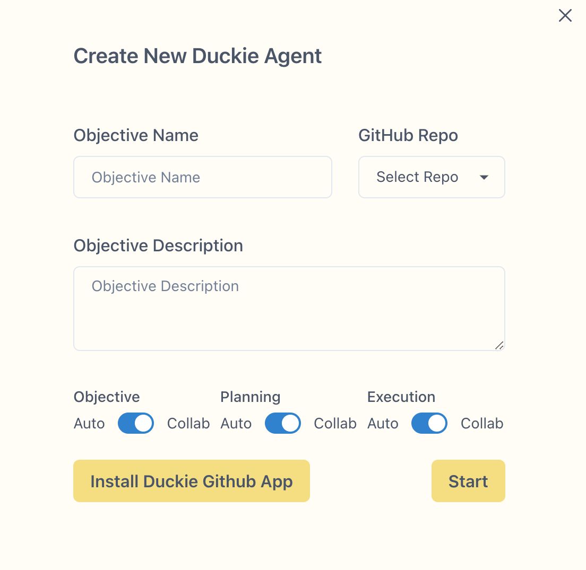

## Setting up

1. Navigate to https://duckie.ai/app
2. Log in with your Github account, and install the Duckie Github App
3. Click "Create a Duckie Agent"

## Guideline
### Write objectives

An Objective includes two parts:

**Objective name** - a summary of what you'd like Duckie to do
 **Objective description** - description of your objective

A good objective would include two key elements:
1. where the code changes should be - file names, function names.
2. what to change - give clear instructions to Duckie on what to change

Sample Objectives:

### Interact with Duckie
You can interact with Duckie throughout the dev flow: 

**Objective Clarification**  
Duckie will ask you questions regarding your objective, to align with you on the.  

**Planning**  
After getting a clear idea on the objective, Duckie will start planning. You can provide feedback to Duckie regarding the plan, and Duckie will revise the plan accordingly.  

**Task Executions**   
After setting a plan, Duckie will start executing the tasks. You can chat with Duckie to make any modifications to the task.  

**Code Review**  
After tasks are finished, Duckie will publish a Pull Request for you. You can directly comment on the PR, and Duckie will publish new commits to address them.  

## Limitations
Right now, we recommend use Duckie for coding tasks that require:
   < 200 lines of changes
   < 5 files to be modified
   each file to be modified should have < 16k characters

If you want Duckie to work on a more complex tasks, we recommend break them down to sub-tasks and create a Duckie agent for each one.