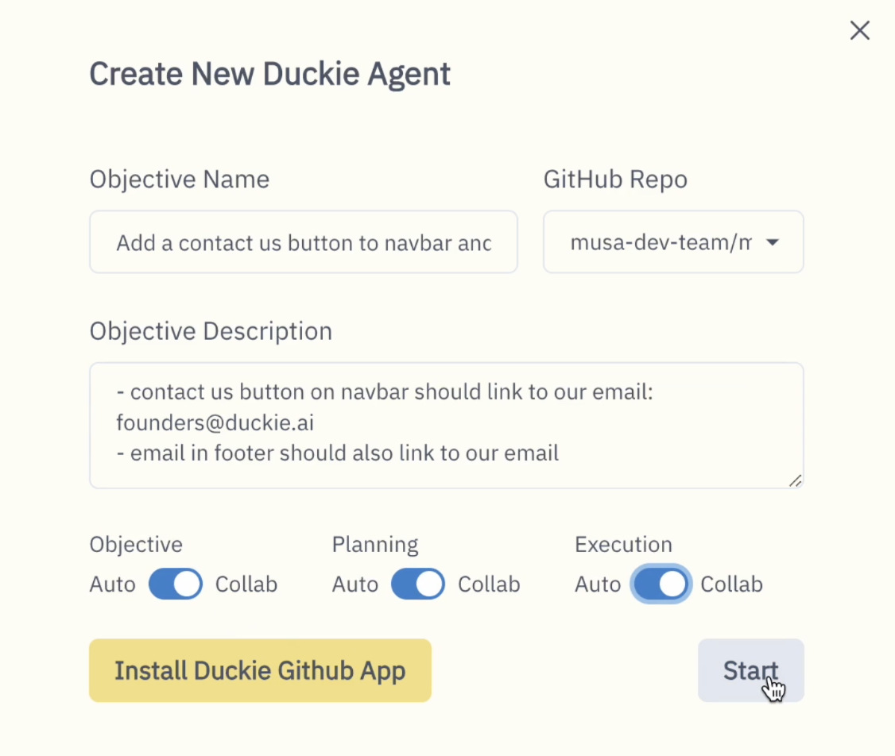
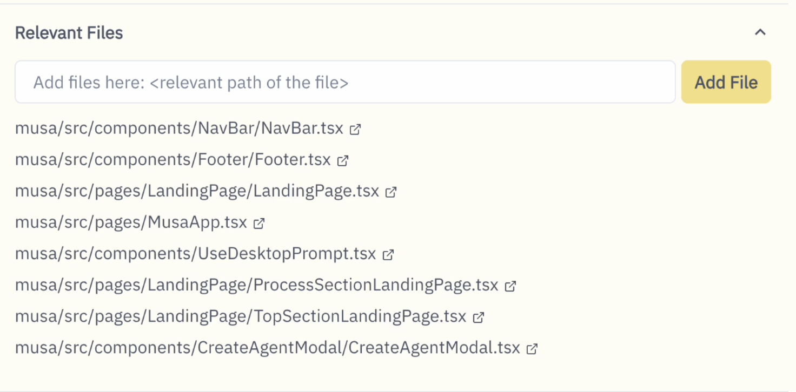
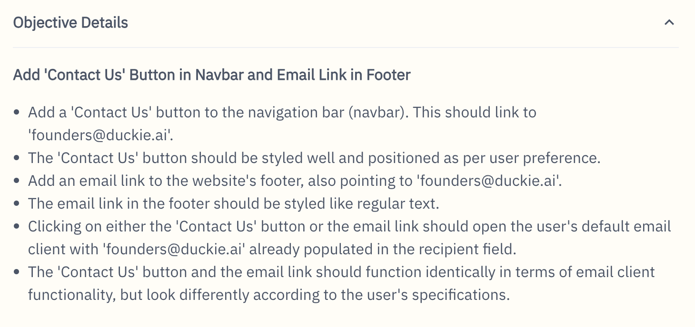
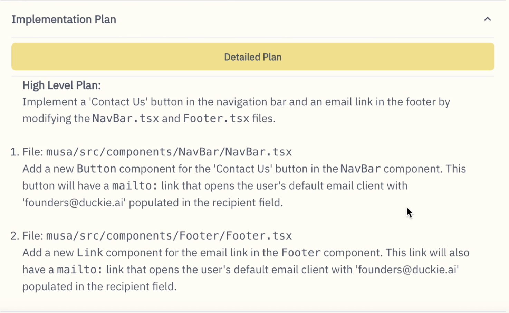
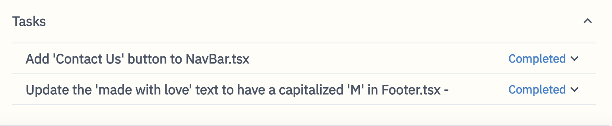
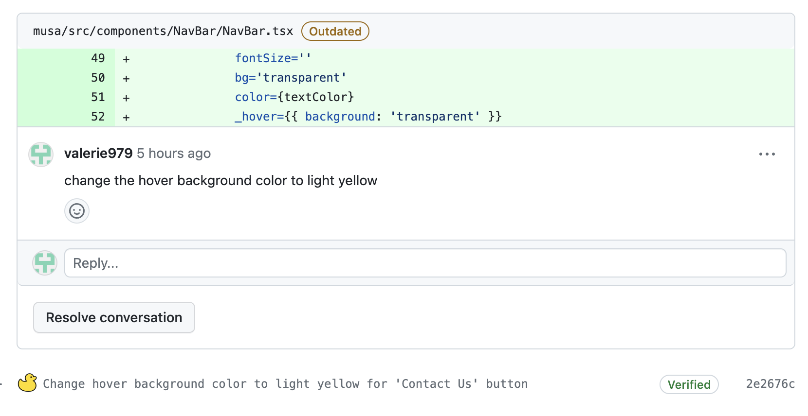

<video
  autoPlay
  muted
  loop
  playsinline
  className="w-full aspect-video"
  src="logo/demo-2.mp4"
></video>
Demo video not playing? Go to https://youtu.be/dluY4E7sgEQ
## Setting up

1. Navigate to https://duckie.ai
2. Click "Try Duckie", and log in with your Github account
3. Click "Create a Duckie Agent"

## Guidelines
### Write objectives

An Objective includes two parts:

**Objective name** - a summary of what you'd like Duckie to do
 **Objective description** - details of your objective

A good objective would include two key elements:
1. where to change - include file paths, function names.
2. what to change - give clear instructions on what your goal is and what to change

If you want to interact with Duckie, please turn on Collab Mode.

### Add files

Duckie will then search for relevant files based on your objective. If Duckie missed any relevant files, please add the file path here.

### Interact with Duckie
If you turn on Collab Mode, you can interact with Duckie throughout the dev flow: 

**Objective Clarification**  

Duckie will ask you questions to clarify the objective. If you think the objective is clear enough, you can skip and continue to planning.

**Planning**  

After getting a clear idea on the objective, Duckie will propose plans. You can provide feedback on the plan, and Duckie will revise it accordingly.  

**Task Execution**  
 
After setting a plan, Duckie will start executing the tasks. You can chat with Duckie to make any modifications to the task.  

**Code Review** (Beta)

After tasks are finished, Duckie will publish a Pull Request for you. You can directly comment on the PR, and Duckie will publish new commits to address them.  

## Limitations
Right now, we recommend use Duckie for coding tasks that require:
   < 200 lines of changes
   < 5 files to be modified
   each file to be modified should have < 16k characters

If you want Duckie to work on a more complex tasks, we recommend break them down to sub-tasks and create a Duckie agent for each one.